# Copy Pools — Initial Draft (README)

## 🧭 Overview

**Copy Pools** is a Revert-like liquidity management platform built initially for **Uniswap v4**. It allows users to manage LP positions—create, join, adjust ranges, claim fees, and manually compound rewards—through a decentralized, non-custodial interface.

The architecture is designed to scale horizontally across **multiple protocols (v3, v4, Algebra, Ambient)** and **multiple chains (Base, Arbitrum, Polygon)** in later phases.

---

## 🏗️ Architecture Summary

```mermaid
flowchart LR
  subgraph UI[Web App (Next.js + Wagmi/Viem)]
    LP[LP Ops: Add/Remove/Adjust/Claim/Compound]
    AN[Analytics: APR, PnL, Health, Ticks]
  end

  subgraph SVC[Backend & Services]
    API[REST API]
    IDX[Ponder Indexer → Postgres]
    Q[Job Queue (BullMQ) → Redis]
  end

  subgraph CHAIN[On-Chain]
    subgraph CP[CopyPools Contracts]
      LM[LPManager (UUPS)]
      HA[HookAdapterV4]
      RH[RangeHelper]
      FC[FeeCollector (future)]
    end
    U4[(Uniswap v4 Pools + Hooks)]
  end

  UI <-->|read| API
  UI -->|wallet tx (viem)| CP
  API <-->|events| IDX
  API --> Q
  CP <-->|calls| U4
```

### Design Principles

* **Modular Adapters:** isolate per-protocol logic via `ILiquidityAdapter`.
* **Upgradeability:** all core contracts use **UUPS**.
* **Event-first indexing:** real-time sync with **Ponder**.
* **Non-custodial:** user retains LP NFT ownership.

---

## 🧩 Detailed Architecture Explanation

### 1) Frontend (Next.js + Wagmi/Viem)

* **Responsibilities:** wallet connect, pool/position views, tx builders (add/remove/compound/move), analytics visualization (APR, PnL, in-range health, tick charts).
* **State/Data:** TanStack Query for API reads; Zustand for ephemeral UI state; request deduplication & optimistic updates on tx submit.
* **Safety UX:** slippage & TTL inputs, route preview, oracle badges (TWAP vs Chainlink deviation), gas estimates, failure fallbacks.
* **Extensibility:** feature flags (env-based) to toggle Paymaster, private orderflow, and pool allowlist badges.

### 2) API Services (Hono/Express)

* **Responsibilities:** expose normalized read models: positions, actions, pool metrics (APR/price/tick/TVL), health scores; serve chart data; gatekeeper for heavy queries.
* **Composition:** stateless REST; reads from Postgres; caches hot paths in Redis with short TTLs; pushes heavy work to BullMQ workers.
* **Error Handling:** typed error taxonomy (4xx user, 5xx system), idempotent endpoints, pagination & rate-limits.

### 3) Indexer (Ponder → Postgres)

* **Responsibilities:** subscribe to LPManager + selected v4 pool events; write `Position`, `Action`, `Pool` rows; maintain derived views.
* **Data Model:**

  * `Position{id, owner, pool, lower, upper, liquidity, lastCompoundAt}`
  * `Action{id, type, positionId, amounts, ts, txHash}`
  * `Pool{id, chainId, feeTier, hook, codehash, depthAtMid, volume7d}`
* **Idempotency:** block/tx/log-index checkpoints; replay-safe handlers; backfill jobs can re-run.

### 4) Workers (BullMQ → Redis)

* **Responsibilities:** periodic APR7/APR30 computation, tick snapshots, health scoring, pool scoring (APR·Depth·HookRisk), cache warmers.
* **Reliability:** retries (exponential backoff), dead-letter queue, metrics via bull-board + Prometheus exporters.

### 5) Smart Contracts (UUPS)

* **LPManager:** validates inputs, routes to adapters, emits canonical events; enforces minOut/TTL; integrates permit2; pausable per-pool; timelocked upgrades.
* **HookAdapterV4:** single responsibility for Uniswap v4 calls (create/modify, collect, swap, increaseLiquidity); swappable router interface (native first; Universal Router optional later).
* **RangeHelper:** pure/view math (ticks, sqrtPrice, distance-to-bounds, modify vs burn+mint thresholds based on ticks-to-cross).
* **FeeCollector (future):** performance fee switch; can be wired to auto-compounder vaults later without touching LPManager.

### 6) Oracles & MEV Controls

* **Hybrid Oracle:** action guarded if `|TWAP - Chainlink| > threshold`.
* **MEV Mitigation:** exact-output swaps with `minReceive`, atomic collect→swap→add, TWAP gating, optional private submission (Flashbots/MEV-Share), chunked large moves.

### 7) Security & Governance

* **Security:** checks-effects-interactions, reentrancy guards, bounded external calls, revert-reason surfacing; fuzz/invariant tests.
* **Governance:** roles via OZ AccessControl; `UPGRADER_ROLE` behind timelocked multisig; emergency `pausePool(pool)`.

---

## ⚙️ Smart Contracts (V1)

### LPManager (UUPS)

* Core entry point: create/join pool, add/remove liquidity, move ranges.
* Manual compound: collect → swap → addLiquidity.
* Safe approvals, slippage + TTL checks.

### HookAdapterV4

* Protocol abstraction for Uniswap v4 pools.
* Supports pool discovery, liquidity changes, fee accrual, and token swaps.

### RangeHelper & FeeCollector

* `RangeHelper`: tick math, price boundaries, range health.
* `FeeCollector`: placeholder for future performance-fee logic.

---

## 🔄 Core Flows

### Add Liquidity


### Manual Compound

```mermaid
sequenceDiagram
  autonumber
  User->>UI: Click “Compound”
  UI->>LM: manualCompound(tokenId)
  LM->>HA: collect fees + optional swap
  HA->>U4: increaseLiquidity
  U4-->>LM: new liquidity
  LM-->>UI: emit ManuallyCompounded
```



---

## 🧮 Indexer & Data Layer

* **Indexer:** Ponder subscribes to LPManager + pool events.
* **Database:** Postgres entities for `Position`, `Action`, and `Pool`.
* **Workers:** BullMQ jobs (Redis) recompute 7d/30d APR and health metrics.

**Endpoints**

```
GET /positions?owner=0x...
GET /positions/:tokenId
GET /pools/:id/metrics
GET /actions?owner=0x...
```

---

## 🛡️ Safety & MEV Protection

* **TWAP-gated execution** to avoid flashloan-based price spikes.
* **Exact-output swaps** with `minReceive` + TTL for compounding.
* **Hybrid Oracle**: abort if |TWAP - Chainlink| > 1%.
* **Optional private orderflow (Flashbots/MEV-Share)** for large positions.

---

## 🧰 Infrastructure & Deployment

| Layer     | Tool               | Notes                      |
| --------- | ------------------ | -------------------------- |
| Contracts | Foundry + Hardhat  | Deployment & testing       |
| Indexer   | Ponder             | Real-time event processing |
| Database  | Postgres           | Persistent position data   |
| Queue     | BullMQ + Redis     | APR/health background jobs |
| API       | Express/Hono       | REST endpoints for UI      |
| Web       | Next.js 14 + Wagmi | Vercel hosted              |

---

## 🗓️ 10-Week Roadmap (Detailed, Org-Level)

### Milestone Overview

* **M1 (W3):** Core contracts complete & tested locally
* **M2 (W5):** First full LP flow on testnet (Add/Remove)
* **M3 (W7):** Analytics (APR/Health/Ticks) live in UI
* **M4 (W9):** Beta-ready build + onboarding
* **M5 (W10):** Mainnet MVP launch

### Week-by-Week Breakdown (with Exit Criteria & Artifacts)

#### **Week 1 — Architecture & Environment**

**Deliverables:**

* Finalized diagrams, storage layout, adapter interfaces (`ILiquidityAdapter`, `IRouter`), upgrade plan (UUPS).
* Monorepo (Turborepo) with packages: `contracts/`, `apps/web/`, `services/api/`, `indexers/ponder/`, `packages/shared/`.
* Docker Compose (Postgres, Redis), local Uniswap v4 fork; CI (lint, typecheck, unit/forge, gas snapshots).
  **Exit Criteria:** CI green, local `make up` brings full stack.
  **Artifacts:** `/docs/arch.md`, `/docs/adr/0001-uups.md`.

#### **Week 2 — Contracts I (LP Core)**

**Deliverables:** `LPManager (UUPS)` with `addLiquidity`, `removeLiquidity`, core events; `HookAdapterV4` stub; `PositionMeta` mappings; Foundry unit tests.
**Exit Criteria:** add/remove pass on local fork; >70% cov; proxy upgrade smoke test.
**Artifacts:** `artifacts/LPManager.json`, `deploy/00_deploy.ts`.

#### **Week 3 — Contracts II (Compound & Range)**

**Deliverables:** `claimFees`, `manualCompound`, `moveRange`; `RangeHelper`; `FeeCollector` stub; permit2; TWAP reads; invariant/fuzz suite; reentrancy guards.
**Exit Criteria:** >85% coverage; invariants pass; gas deltas recorded. **(M1)**
**Artifacts:** `reports/coverage.html`, `reports/gas.md`.

#### **Week 4 — Services I (API & Indexer Bootstrapping)**

**Deliverables:** Ponder entities (`Position`, `Pool`, `Action`); Postgres migrations; REST endpoints: `/positions`, `/positions/:id`, `/actions`; BullMQ workers (retry/backoff/DLQ).
**Exit Criteria:** create position → indexed → visible via API.
**Artifacts:** `openapi.yaml`, `migrations/*.sql`.

#### **Week 5 — Web I (Core Flows on Testnet)**

**Deliverables:** Wallet connect (MetaMask/Rabby); Pool List/Detail; Add/Remove forms with preview (slippage, TTL, gas); testnet deploy & verify; public staging URL.
**Exit Criteria:** first add/remove succeeds on testnet. **(M2)**
**Artifacts:** `apps/web/.env.staging`, explorer links, staging URL.

#### **Week 6 — Web II (Claim/Compound + Analytics)**

**Deliverables:** Claim & Manual Compound UI; analytics jobs (APR7/30, tick snapshots); health metric (in-range %, distance to bounds); `/pools/:id/metrics` API; hybrid oracle checks.
**Exit Criteria:** APR & health visible in UI; compound works on testnet. **(M3)**
**Artifacts:** `dashboards/metrics.json`, screenshots for docs.

#### **Week 7 — Quality & Performance**

**Deliverables:** UI polish (range slider, tick grid perf); API caching/pagination/rate limits; indexer backfills & replay; contract gas optimizations (modify vs burn+mint thresholds).
**Exit Criteria:** Playwright e2e pass; p95 API <300ms on staging; **M3 reinforced**.
**Artifacts:** `reports/perf.md`, `playwright-report/`.

#### **Week 8 — Security, Ops & Governance**

**Deliverables:** Slither/Mythril static, Echidna fuzz; pause switches per pool; timelock setup; monitoring (Sentry, Prometheus/Grafana), bull-board; incident runbooks.
**Exit Criteria:** audit checklist complete; monitoring live; beta flag on.
**Artifacts:** `docs/security-checklist.md`, `docs/runbooks/*.md`.

#### **Week 9 — Beta & Onboarding**

**Deliverables:** Onboarding guides, tooltips, risk disclaimers; pool allowlist UI + HookRisk badges; mainnet rehearsal; migration scripts; versioned release notes.
**Exit Criteria:** beta build approved; dry-run mainnet deploy passes. **(M4)**
**Artifacts:** `CHANGELOG.md`, `scripts/migrate.ts`.

#### **Week 10 — Launch & Feedback Loop**

**Deliverables:** Mainnet deploy & verification; API + workers prod; indexer backfill & cache warm; telemetry (PostHog/Sentry); feedback intake; draft V1.5 plan (auto-compounder, referrals, scoring splits, Paymaster).
**Exit Criteria:** Stable mainnet for 7d; KPIs tracked (DAU, positions, success rate). **(M5)**
**Artifacts:** `addresses.json`, `ABIs/`, `docs/v1.5-plan.md`.

### Mermaid Gantt (Paste-ready)

```mermaid
gantt
  title Copy Pools V1 — 10-Week Roadmap
  dateFormat  YYYY-MM-DD
  section Architecture & Setup
  Arch & Env (W1)        :done,    a1, 2025-10-29, 7d
  section Contracts
  LP Core (W2)           :active,  c1, 2025-11-05, 7d
  Compound & Range (W3)  :         c2, 2025-11-12, 7d
  section Services
  API+Indexer (W4)       :         s1, 2025-11-19, 7d
  section Web App
  Core Flows (W5)        :         w1, 2025-11-26, 7d
  Claim+Analytics (W6)   :         w2, 2025-12-03, 7d
  section Quality & Security
  Perf & QA (W7)         :         q1, 2025-12-10, 7d
  Security & Ops (W8)    :         q2, 2025-12-17, 7d
  section Launch
  Beta & Onboarding (W9) :         l1, 2025-12-24, 7d
  Mainnet Launch (W10)   :         l2, 2025-12-31, 7d
```



---

## 🆚 Architecture Comparison — Revert vs Copy Pools V1

### Summary Table

| Dimension                  | **Revert Finance**                               | **Copy Pools V1**                                                           |
| -------------------------- | ------------------------------------------------ | --------------------------------------------------------------------------- |
| **Primary Protocol (now)** | Uniswap **V3** (mature auto-compound, analytics) | Uniswap **V4** (native hooks), V3-ready via adapter                         |
| **Architecture Layers**    | UI ↔ Data Services ↔ Contracts                   | UI ↔ API/Indexer/Jobs ↔ Contracts (same structure)                          |
| **Contract Pattern**       | Per-vault/position managers (often non-proxy)    | **UUPS proxy** core + **adapter layer** for protocols                       |
| **Upgradeability**         | Mixed (new deployments for changes)              | Timelocked **UUPS** upgrades + storage gaps                                 |
| **Protocol Abstraction**   | V3-specific tooling                              | `ILiquidityAdapter` (V4 today; V3/Algebra/Ambient tomorrow)                 |
| **Hooks Dependency**       | N/A (V3)                                         | V4 **HookAdapter**, hook risk registry (codehash, owner)                    |
| **MEV Protections**        | Slippage/TTL; some private routing               | **TWAP-gated**, hybrid Oracle (TWAP+CL), private orderflow, atomic compound |
| **Compounding**            | Automated vaults, performance fee                | Manual first; auto-compounder as V1.5 (FeeCollector switch)                 |
| **Pool Selection**         | Fee tier & depth; fewer pools                    | Allowlist + scoring (APR·Depth·HookRisk) mitigating v4 fragmentation        |
| **Indexing**               | Proprietary + The Graph                          | **Ponder** (TS-native) + Postgres + BullMQ                                  |
| **Analytics**              | APR, backtests, incentives                       | APR7/30, PnL, health, tick charts (extensible)                              |
| **Lending**                | Revert Lend (LP NFT collateral)                  | Deferred (Phase 2), compatible with oracle/adapter design                   |
| **Gas Strategy**           | Standard modify flows                            | Heuristic: modify vs burn+mint; grid-snap; simulation gates                 |
| **Custody**                | Non-custodial                                    | Non-custodial; Permit2 approvals                                            |
| **Gasless**                | Not core                                         | Optional **Paymaster** stubs (off by default)                               |

### Pros / Cons Snapshot

* **Revert Pros:** production-proven V3 tooling, deep analytics, auto-compounding vaults, lending live.
* **Revert Cons:** V4-native support less mature; adaptation requires new abstractions; upgrades via redeployments more common.
* **Copy Pools Pros:** V4-native with adapters; upgrade-safe; safety-first MEV/oracle guards; faster TS-native data pipeline.
* **Copy Pools Risks:** New surface area (v4 hooks); must keep adapter boundary tight; rely on indexer correctness.

### Side-by-Side Diagram (Conceptual)

```mermaid
flowchart LR
  subgraph Revert
    RUI[Revert UI]
    RSVC[Data Services / Backtests]
    RSC[Contracts (V3 Position Mgmt / Vaults)]
    RV3[(Uniswap V3)]
  end

  subgraph CopyPools
    CUI[Copy Pools UI]
    CAPIs[API + Ponder + BullMQ]
    CSC[UUPS LPManager + HookAdapter]
    CV4[(Uniswap V4 + Hooks)]
  end

  RUI-->RSVC-->RSC-->RV3
  CUI-->CAPIs-->CSC-->CV4
```

---|---|---|
| **Primary Protocol (now)** | Uniswap **V3** (mature auto-compound, analytics) | Uniswap **V4** (native hooks), V3-ready via adapter |
| **Architecture Layers** | UI ↔ Data Services ↔ Contracts | UI ↔ API/Indexer/Jobs ↔ Contracts (same structure) |
| **Contract Pattern** | Per-vault/position managers (non-proxy in many cases) | **UUPS proxy** core + **adapter layer** for protocols |
| **Upgradeability** | Mixed (often upgrades via new deployments) | Timelocked **UUPS** upgrades + storage gaps |
| **Protocol Abstraction** | V3-specific tooling | `ILiquidityAdapter` (V4 today; V3/Algebra/Ambient tomorrow) |
| **Hooks Dependency** | N/A (V3) | V4 **HookAdapter**, hook risk registry (codehash, owner) |
| **MEV Protections** | Slippage/TTL; some private routing | **TWAP-gated**, hybrid Oracle (TWAP+CL), private orderflow, atomic compound |
| **Compounding** | Automated vaults, performance fee | Manual first; auto-compounder as V1.5 (FeeCollector switch) |
| **Pool Selection** | By fee tier & depth; V3 fewer pools | V4 fragmentation handled by allowlist + scoring (APR/Depth/HookRisk) |
| **Indexing** | Proprietary + The Graph | **Ponder** (TS-native) + Postgres + BullMQ jobs |
| **Analytics** | APR, backtests, incentives | APR7/30, PnL, health, tick charts (extensible) |
| **Lending** | Revert Lend (LP NFT collateral) | Deferred (Phase 2), compatible with adapter & oracle design |
| **Gas Strategy** | Standard modify flows | Heuristic: modify vs burn+mint, grid-snap, simulation gates |
| **Custody** | Non-custodial | Non-custodial, approvals via Permit2 |
| **Gasless** | Not core | Optional **Paymaster** stubs (off by default) |

### Side-by-Side Diagram (Conceptual)

```mermaid
flowchart LR
  subgraph Revert
    RUI[Revert UI]
    RSVC[Data Services / Backtests]
    RSC[Contracts (V3 Position Mgmt / Vaults)]
    RV3[(Uniswap V3)]
  end

  subgraph CopyPools
    CUI[Copy Pools UI]
    CAPIs[API + Ponder + BullMQ]
    CSC[UUPS LPManager + HookAdapter]
    CV4[(Uniswap V4 + Hooks)]
  end

  RUI-->RSVC-->RSC-->RV3
  CUI-->CAPIs-->CSC-->CV4
```

### Key Differentiators (Why Copy Pools Now)

1. **V4-native**: Hooks-aware adapter and hook risk registry.
2. **Upgrade-ready**: UUPS + timelock from day one (no full redeploys for small changes).
3. **Extensibility**: Clean `ILiquidityAdapter` lets us add Algebra/Ambient without touching the core.
4. **Safety-first**: TWAP gates + Chainlink sanity + private orderflow + atomic compound.
5. **Data velocity**: Ponder + BullMQ = faster iteration vs heavy Graph pipelines.

---

## 🔭 Future Scope & Optional Modules

### 1) Protocol Adapters

* **Uniswap v3 Adapter:** reuse `ILiquidityAdapter` to support NFT positions; adjust tick math; disable hook-specific paths.
* **SushiSwap Adapter:** for chains where Sushi uses V3-style concentrated liquidity; normalize fee collection and modify flows.
* **PancakeSwap (v3/v4):** v3 parity with Uni v3; if v4-equivalent launches, reuse HookAdapter with chain/protocol registry.
* **Algebra / Ambient:** integrate non-uni math & pool discovery; ensure APR calculations align with protocol fee mechanics.

### 2) Strategy Layer (V1.5+)

* **Auto-Compounder Vaults:** separate strategy contracts that call LPManager; optional performance fee via `FeeCollector`.
* **Rebalancing Policies:** grid/capped-volatility/vol-target — configurable templates per user or per pool.
* **Pool Selection Engine:** scoring with incentives feeds; optional split across top-N pools.

### 3) Cross-Chain & Gasless

* **Cross-Chain LP:** CCIP/LxLy message layer; mirrored metadata; off-chain coordination for quotes.
* **Gasless:** Paymaster integration with policy (cap per wallet, volume-based allowlist); never custodial.

### 4) Lending / Borrowing (Phase 2)

* **LP-NFT Collateral:** vault accepts LP positions; `V3Oracle/V4Oracle` hybrid (TWAP + Chainlink) for valuation.
* **Interest Rate Model:** utilization-based; liquidation with partial close; backstop reserves.
* **Risk:** oracle manipulation, out-of-range positions; mitigated via oracle sanity windows + health thresholds.

### 5) Referrals / Points / Rewards

* **Off-chain counter + Merkle airdrop** initially; migrate to on-chain points later.
* **Questing:** compound or rebalance actions earn points; anti-sybil filters via wallet age/activity.

### 6) Governance & Token (Optional)

* **Timelocked parameter changes**, fee switches, allowlist management.
* **Token:** if introduced, utility for fee discounts, staking for referral boost, vote on pool scoring weights.

---

## 🔍 Open Questions

1. MVP target chain (Base, Arbitrum, or Polygon)?
2. Curated vs custom pool creation?
3. APR window default (7d/30d/90d) and preferred charting lib?
4. Prioritize Paymaster in V1 or defer to V1.5?
